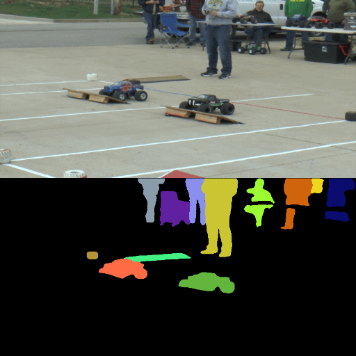

# Mask Selection and Propagation for Unsupervised Video Object Segmentation

## Introduction
[[**WACV**](https://openaccess.thecvf.com/content/WACV2021/papers/Garg_Mask_Selection_and_Propagation_for_Unsupervised_Video_Object_Segmentation_WACV_2021_paper.pdf)] [[**CVPRW**](https://davischallenge.org/challenge2020/papers/DAVIS-Unsupervised-Challenge-1st-Team.pdf)]



## Prerequisites
pytorch >= 1.4

python 3.6

## Inferencing
To run the code you will be needing masks from Mask R-CNN and DAVIS dataset. The pre-trained weights of STM can be downloaded from [here](https://github.com/seoungwugoh/STM) and selector_net from [here](https://drive.google.com/file/d/1PRdYnrSgvHmfi9G85pPbqhD2Ns0nm4NS/view?usp=sharing). The output masks of Mask R-CNN should be numbered sequentially starting from 0 representing background. Select top 10 masks from the masks whose confidence score is more than 0.1. 

1. Place the masks in `path_to_data_dir/Annotations/480p` and the DAVIS frames in `path_to_data_dir/JPEGImages/480p`. 
2. Place the downloaded weights of STM and selecto_net in `checkpoint` folder. There are 3 parts of the method criterion 1, criteria 2, stage 3. 
3. Evaluate using criterion 1 by executing `run.sh`(change the datapath).
4. Change the python script name in `run.sh` to `eval_DAVIS_crit2.py` to evaluate using criterion 2. 
5. Finally, run `eval_stage_3.py` using command below by giving relavent paths of masks generated using criterion 1 and criterion 2. 

```
python eval_stage_3.py -m1 results/STM_DAVIS_2019challenge -m2 results/STM_DAVIS_2019challenge2/ -r data/DAVIS/JPEGImages/480p/ -f set_file.txt
```
### Note
Selector net has been trained using Mask R-CNN outputs and the output masks of Mask R-CNN can highly vary depending on various implementations and even different hyperparameter in the same implementation. Hence, to get the true results of the method it is desirable to train the selector_net using the object detection and segmentation network that you are using. Training selector_net should not take more than 1hr. Training details are given below.

To run the code on other datasets, change the structure of datafiles to that of DAVIS dataset then the same scripts can be used.

## Training
The training dataset needs to generated using DAVIS [TrainVal](https://davischallenge.org/davis2017/code.html#unsupervised) before training selector net. Follow the steps to generate dataset
1. Generate masks using Mask R-CNN for each frames in the dataset.
2. Generate masks using vanilla STM for each frames in the dataset.

    a) Pass the ground truth frame as first frame
    
    b) Use ground truth frames instead of criterion1/2 to compare Mask R-CNN ouput and STM output and then propogate frames.
    
    c) The scripts `eval_DAVIS_crit1.py` can be used by replacing the selection criterion as explained b).
    
3. Use the hungarian algorithm to assign the generated masks to the corresponding ground truth in the dataset(similar to this [code](https://github.com/vidit98/FrameSelect/blob/2f114c25eb869056a26d7a00ec2c5519419d3cfe/eval_DAVIS_crit1.py#L86))

Run the following script
```
python train.py --train_dataset_path #path_to_davis_data --maskrcnn_dataset_path #path_to_maskrcnn_masks --stm_dataset_path #path_to_STM_masks
```


## Precomputed Results

The pre-computed for DAVIS 2019 dev unsupervised dataset coloured results after stage 3 can be found [here](https://drive.google.com/file/d/1UTo8BjupsLd8X_kkFzuM7ACt-L5J-K8W/view?usp=sharing)

## Citations
Please cite the following papers if the work was helpful.
```
@inproceedings{garg2021mask,
  title={Mask Selection and Propagation for Unsupervised Video Object Segmentation},
  author={Garg, Shubhika and Goel, Vidit},
  booktitle={Proceedings of the IEEE/CVF Winter Conference on Applications of Computer Vision},
  pages={1680--1690},
  year={2021}
}
```
```
@article{DAVIS2020-Unsupervised-1st,
              author = {S. Garg, V. Goel, S. Kumar},
              title = {Unsupervised Video Object Segmentation using Online Mask Selection and Space-time Memory Networks},
              journal = {The 2020 DAVIS Challenge on Video Object Segmentation - CVPR Workshops},
              year = {2020}
}
```
            


